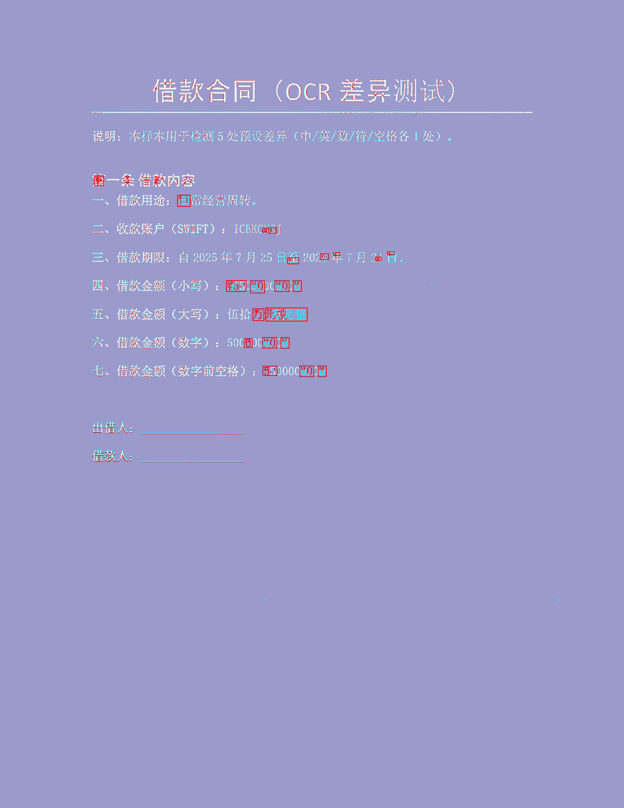

# Pixel-Diff

Pixel-Diff 用于比对“审批通过的电子 PDF/模板图”与“打印、签署后形成的扫描件/待检图”，在像素几何层面识别正文中的疑似新增、删除和修改。

本项目不使用 OCR，不判断文本语义，也不直接给出法律、合规或合同效力结论。输出结果用于人工复核。

## 环境要求

- Python 3.11 或更高版本
- OpenCV、NumPy、PyMuPDF、PyYAML

如果当前仓库已有 `.venv`，可以直接使用：

```powershell
.\.venv\Scripts\python.exe --version
```

如需重新安装：

```powershell
py -3.11 -m venv .venv
.\.venv\Scripts\python.exe -m pip install -e ".[dev]"
```

## 测试pdf文档说明

1.document1和2是单页文书和多页文书，3是表格，4是页眉；

2.v1为基准版，v2为修改版，v3为扫描件，v4为扫描歪了（页眉文件的v3是放大页眉）；

3.document1_v5是iPad good notes扫描的结果，由于扫描不清晰造成的误判会有很多;

4.document1_v6/v7/v8是正角度偏转，v9/v10是负角度偏转（角度均为小角度小于2°）。


## 命令行运行

参数顺序是：

```text
scripts\compare.py 待检/扫描文件 模板/审批通过文件
```

生成红框标注图和文字残影图：（ghost）

```powershell
.\.venv\Scripts\python.exe scripts\compare.py test_pdf\document1_v3.pdf test_pdf\document1_v1.pdf --visual artifacts\result.png --ghost artifacts\heatmap.png
```

每次写出文件时，CLI 会自动新建本次运行目录，例如：

```text
artifacts\20260710_153000_000000_document1_v1_vs_document1_v3\result.png
artifacts\20260710_153000_000000_document1_v1_vs_document1_v3\heatmap.png
```

目录名中的 `document1_v1_vs_document1_v3` 表示“模板文件 vs 待检文件”。

命令执行完成后，终端只打印简短摘要和输出路径，不再打印完整 JSON。只要指定了 `--visual`、`--ghost`、`--json` 或 `--report-dir` 中的任意输出参数，程序都会在本次运行目录下写出 `diff_result.json`。例如：

```text
completed page=1 differences=15
json: artifacts\20260713_150000_000000_document1_v1_vs_document1_v3\diff_result.json
visual: artifacts\20260713_150000_000000_document1_v1_vs_document1_v3\result.png
ghost: artifacts\20260713_150000_000000_document1_v1_vs_document1_v3\heatmap.png
output_dir: artifacts\20260713_150000_000000_document1_v1_vs_document1_v3
```

## 报告包输出

推荐使用报告包模式，输出结构更接近人工复核场景：

```powershell
.\.venv\Scripts\python.exe scripts\compare.py test_pdf\document1_v3.pdf test_pdf\document1_v1.pdf --report-dir artifacts
```

`.\.venv\Scripts\python.exe scripts\compare.py test_imgs\img1.jpg test_imgs\img21.jpg --report-dir artifacts`


报告包模式默认比对两份 PDF 的全部页面。两份 PDF 页数必须一致；如果页数不一致，程序会直接报输入错误。

如果只想比对某一页，可以传入从 `0` 开始的页码：

```powershell
.\.venv\Scripts\python.exe scripts\compare.py test_pdf\document1_v3.pdf test_pdf\document1_v1.pdf --report-dir artifacts --page 1
```

输出示例：

```text
artifacts\<run_id>\
├── diff_result.json
└── report\
    ├── diff_report.html
    ├── diff_report.docx
    ├── page_0001_original.png
    ├── page_0001_candidate.png
    └── page_0001_heatmap.png
```

多页 PDF 会继续输出：

```text
report\page_0002_original.png
report\page_0002_candidate.png
report\page_0002_heatmap.png
...
```

文件含义：

- `diff_result.json`：结构化差异坐标、指标和输出路径。
- `report\diff_report.html`：中文 HTML 复核报告，顶部会醒目展示文档差异率，并提供“导出比对报告”按钮。
- `report\diff_report.docx`：可下载的 Word 版比对报告，包含汇总信息、差异率和逐页坐标表。
- `report\page_0001_original.png`：模板/审批通过文件的标准化页面。
- `report\page_0001_candidate.png`：待检/扫描文件修改后的页面。
- `report\page_0001_heatmap.png`：文字残影热力图，并用方框和序号标出疑似差异区域。

报告顶部的文档差异率按以下口径计算：

```text
文档差异率 = 所有疑似差异轮廓面积总和 / 所有页面像素面积总和
```

该指标只用于快速评估像素层面的变化幅度，不代表语义改动比例，也不替代人工复核。

文字残影图颜色含义：

- 红色：模板中存在、待检文件中缺失的笔画。
- 青色：待检文件中存在、模板中不存在的笔画。
- 浅白色：两份文件重合的笔画。
- 紫色背景：无正文笔画区域。

## 数据流向

    compare.py (CLI)
          │ 
          ▼
    engine.compare() 
          ├─ io.load_document_page_bgr() → BGR 300 DPI 图像 
          ├─ color_filter.remove_colored_marks() → 去红章蓝签 
          ├─ alignment.align_scan_to_template() → 对齐到模板坐标系 
          ├─ binarization.binarize_*() → 二值图 (0/255) 
          ├─ differ.xor_difference() → XOR 差异掩码 
          ├─ differ.crop_edges() → 裁边缘 40px 
          ├─ morphology.clean_difference_mask() → 形态学降噪 
          ├─ regions.extract + filter() → 提取差异区域 + 7 级过滤 
          ├─ visualization.draw_*() → 红框图 + 残影图 
          └─ report.render_*() → HTML/DOCX 报告

## JSON 字段说明

`diff_result.json` 是结构化结果文件。普通单页模式的主要字段如下：

```json
{
  "status": "completed",
  "page": 0,
  "image": {"width": 2550, "height": 3301, "dpi": 300},
  "differences": [
    {"id": 1, "x": 725, "y": 794, "width": 52, "height": 50, "area": 2240.0}
  ],
  "metrics": {
    "elapsed_ms": 5216,
    "good_matches": 1404,
    "inlier_ratio": 0.7165
  },
  "visual_output_path": "artifacts\\...\\result.png",
  "metadata": {"ghost_output_path": "artifacts\\...\\heatmap.png"}
}
```

字段含义：

- `status`：任务状态。正常完成时为 `completed`。
- `page`：页码索引，从 `0` 开始。报告中显示时通常按 `page + 1` 展示。
- `image.width`：模板页渲染后的图像宽度，单位为像素。
- `image.height`：模板页渲染后的图像高度，单位为像素。
- `image.dpi`：PDF 渲染 DPI，默认 `300`。
- `differences`：疑似差异区域列表。
- `differences[].id`：当前结果中的区域序号。过滤规则变化后会重新编号，不建议跨版本用旧序号做强绑定。
- `differences[].x`：差异框左上角横坐标，模板坐标系，单位为像素。
- `differences[].y`：差异框左上角纵坐标，模板坐标系，单位为像素。
- `differences[].width`：差异框外接矩形宽度，单位为像素。
- `differences[].height`：差异框外接矩形高度，单位为像素。
- `differences[].area`：差异轮廓面积，由 OpenCV 轮廓面积计算得到，单位近似为像素面积。
- `metrics.elapsed_ms`：本页处理耗时，单位为毫秒。
- `metrics.good_matches`：SIFT/FLANN/Lowe 比率测试后保留下来的有效匹配点数量。
- `metrics.inlier_ratio`：RANSAC 单应性估计中的内点比例，用于观察配准质量。
- `visual_output_path`：红框标注图路径。未请求该输出时可能为 `null`。
- `metadata.ghost_output_path`：文字残影图路径。
- `metadata.template_output_path`：报告模式下的原始文档标准化页面图路径。
- `metadata.candidate_output_path`：报告模式下的待检文档配准后页面图路径。

报告包模式的 `diff_result.json` 会在顶层增加多页汇总字段：

- `run_id`：本次运行目录标识。
- `scan_path`：待检文件路径。
- `template_path`：模板文件路径。
- `pages`：每页处理结果摘要。
- `regions`：所有页的区域坐标列表，区域内会带页码信息。
- `total_regions`：所有页疑似差异区域总数。
- `total_diff_area`：所有页疑似差异轮廓面积总和。
- `total_page_area`：所有页面像素面积总和，通常为各页 `image.width * image.height` 的累加。
- `difference_rate`：文档差异率，计算公式为 `total_diff_area / total_page_area`。
- `outputs.docx_output_path`：Word 版比对报告路径。
- `pages[].diff_area`：当前页疑似差异轮廓面积总和。
- `pages[].page_area`：当前页页面像素面积。
- `pages[].difference_rate`：当前页差异率，计算公式为 `pages[].diff_area / pages[].page_area`。

### 为什么 `width * height` 不等于 `area`

`width` 和 `height` 是差异区域外接矩形的宽和高，表示“框”的尺寸；`area` 是实际差异轮廓的面积，表示框内真正有差异的像素形状面积。二者不是同一个概念。

例如一个差异轮廓是弯曲笔画、断开的数字边缘或不规则文字残影，它的外接矩形可能是 `52 x 50 = 2600`，但真实轮廓只占其中一部分，所以 `area` 可能是 `2240.0`。

因此：

```text
width * height = 外接矩形面积
area = 轮廓实际面积
```

`area` 小于或等于外接矩形面积是正常现象。它可以用来衡量差异像素的实际规模，而 `width`、`height` 更适合用来定位和绘制标注框。

## Python 调用

```python
from pixel_diff import PixelDiffConfig, compare

result = compare(
    scan_path="document1_v3.pdf",
    template_path="document1_v1.pdf",
    page=0,
    config=PixelDiffConfig(),
    visual_output_path="artifacts/result.png",
    ghost_output_path="artifacts/heatmap.png",
)

print(result.to_dict())
```

## 效果展示

下面是文字残影热力图示例，红框和序号用于定位疑似差异区域：



## 测试与检查

```powershell
.\.venv\Scripts\python.exe -m pytest
.\.venv\Scripts\python.exe -m ruff check .
.\.venv\Scripts\python.exe -m mypy
```

## 注意事项

- 模板/审批通过文件是基准文件，待检/扫描文件是需要复核的文件。
- 默认按 300 DPI 渲染 PDF。
- 差异坐标使用模板页面坐标系，左上角为原点，单位为像素。
- 红章和蓝色签字默认按配置作为噪声过滤。
- 系统只提供疑似差异，不替代人工裁决。
