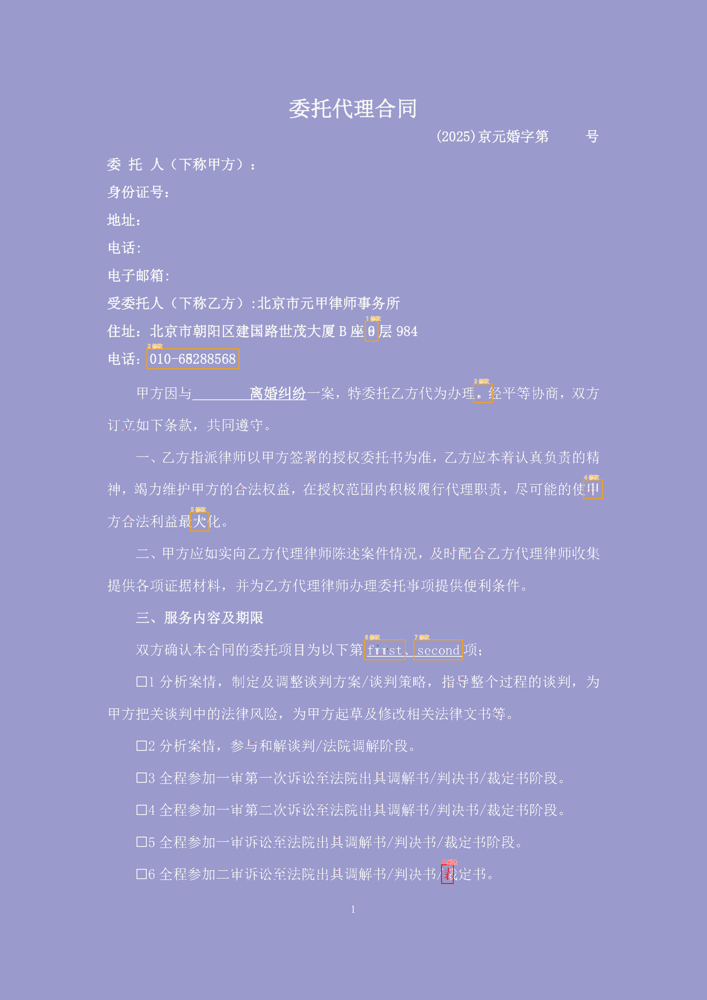
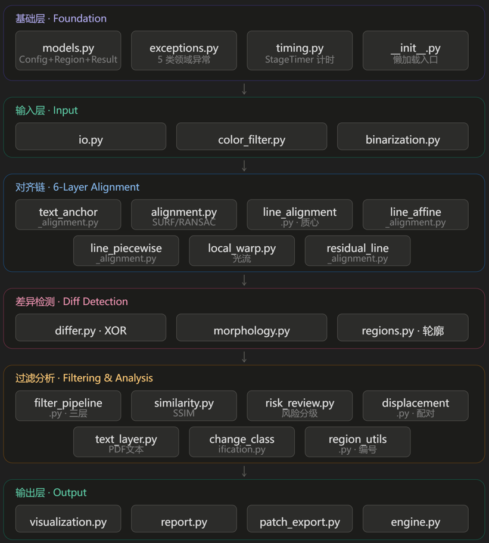

# Pixel-Diff

Pixel-Diff 用于比对“审批通过的电子 PDF/模板图”与“打印、签署后形成的扫描件/待检图”，在像素几何层面识别正文中的疑似新增、删除和修改。

本项目不使用 OCR，不判断文本语义，也不直接给出法律、合规或合同效力结论。输出结果用于人工复核。

## 环境要求

- Python 3.11 或更高版本
- OpenCV、NumPy、PyMuPDF、PyYAML

如果当前仓库已有 `.venv`，可以直接使用：

```powershell
.\.venv\Scripts\python.exe --version
```

如需重新安装：

```powershell
py -3.11 -m venv .venv
.\.venv\Scripts\python.exe -m pip install -e ".[dev]"
```

## 测试pdf文档说明

1.document1和2是单页文书和多页文书，3是表格，4是页眉；

2.v1为基准版，v2为修改版，v3为扫描件，v4为扫描歪了（页眉文件的v3是放大页眉）；

3.document1_v5是iPad good notes扫描的结果，由于扫描不清晰造成的误判会有很多;

4.document1_v6/v7/v8是正角度偏转，v9/v10是负角度偏转（角度均为小角度小于2°）。


## 命令行运行

参数顺序是：（！！！！！！！！！一定注意执行的两个文件顺序不要放反了！！！！！！！！！）

```text
scripts\compare.py 待检/扫描文件 模板/审批通过文件
```

生成红框标注图和文字残影图：（ghost）

```
.\.venv\Scripts\python.exe scripts\compare.py test_pdf\document1_v3.pdf test_pdf\document1_v1.pdf --visual artifacts\result.png --ghost artifacts\heatmap.png
```

```
.\.venv\Scripts\python.exe scripts\compare.py test_pdf\document1_v4.pdf test_pdf\document1_v1.pdf --visual artifacts\result.png --ghost artifacts\heatmap.png --config configs\line_centroid_trial.yaml 
```


每次写出文件时，CLI 会自动新建本次运行目录，例如：

```text
artifacts\20260710_153000_000000_document1_v1_vs_document1_v3\result.png
artifacts\20260710_153000_000000_document1_v1_vs_document1_v3\heatmap.png
```

目录名中的 `document1_v1_vs_document1_v3` 表示“模板文件 vs 待检文件”。

命令执行完成后，终端只打印简短摘要和输出路径，不再打印完整 JSON。只要指定了 `--visual`、`--ghost`、`--json` 或 `--report-dir` 中的任意输出参数，程序都会在本次运行目录下写出 `diff_result.json`。例如：

```text
completed page=1 differences=15
json: artifacts\20260713_150000_000000_document1_v1_vs_document1_v3\diff_result.json
visual: artifacts\20260713_150000_000000_document1_v1_vs_document1_v3\result.png
ghost: artifacts\20260713_150000_000000_document1_v1_vs_document1_v3\heatmap.png
output_dir: artifacts\20260713_150000_000000_document1_v1_vs_document1_v3
```

## 报告包输出

推荐使用报告包模式，输出结构更接近人工复核场景：

```shell
.\.venv\Scripts\python.exe scripts\compare.py test_pdf\document1_v3.pdf test_pdf\document1_v1.pdf --report-dir artifacts #pdf文档检测
```

```shell
.\.venv\Scripts\python.exe scripts\compare.py test_imgs\img1.jpg test_imgs\img21.jpg --report-dir artifacts #图片检测
```

## 粗略识别（base）

```
.\.venv\Scripts\python.exe scripts\compare.py test_pdf\document2_v3.pdf test_pdf\document2_v1.pdf --config .\configs\default.yaml --report-dir artifacts 
```

## 启用行文本质心补偿（避免误报）

```
.\.venv\Scripts\python.exe scripts\compare.py test_pdf\document2_v3.pdf test_pdf\document2_v1.pdf --config configs\line_centroid_trial.yaml --report-dir artifacts
```

## 启用敏感文本召回（避免漏报）

sensitive 配置相比于defalit配置会删除：

* 局部结构相似的错位残差
* 孤立小碎片
* 彩色残差
* SSIM较高的结构残差
* 风险复核判定为 LOW 的区域

```
.\.venv\Scripts\python.exe scripts\compare.py test_pdf\document2_v3.pdf test_pdf\document2_v1.pdf --config .\configs\sensitive_recall_trial.yaml --report-dir artifacts
```


## 开启patch输出

```
.\.venv\Scripts\python.exe scripts\compare.py test_pdf\document2_v3.pdf test_pdf\document2_v1.pdf --config configs\sensitive_recall_trial.yaml --report-dir artifacts --export-patches
```


报告包模式默认比对两份 PDF 的全部页面。两份 PDF 页数必须一致；如果页数不一致，程序会直接报输入错误。

如果只想比对某一页，可以传入从 `0` 开始的页码：

```powershell
.\.venv\Scripts\python.exe scripts\compare.py test_pdf\document1_v3.pdf test_pdf\document1_v1.pdf --report-dir artifacts --page 1
```

输出示例：

```text
artifacts\<run_id>\
├── diff_result.json
└── report\
    ├── diff_report.html
    ├── diff_report.docx
    ├── page_0001_original.png
    ├── page_0001_candidate.png
    └── page_0001_heatmap.png
```

多页 PDF 会继续输出：

```text
report\page_0002_original.png
report\page_0002_candidate.png
report\page_0002_heatmap.png
...
```

文件含义：

- `diff_result.json`：结构化差异坐标、指标和输出路径。
- `report\diff_report.html`：中文 HTML 复核报告，顶部会醒目展示文档差异率，并提供“导出比对报告”按钮。
- `report\diff_report.docx`：可下载的 Word 版比对报告，包含汇总信息、差异率和逐页坐标表。
- `report\page_0001_original.png`：模板/审批通过文件的标准化页面。
- `report\page_0001_candidate.png`：待检/扫描文件配准后的页面。
- `report\page_0001_heatmap.png`：文字残影热力图，并用方框和序号标出疑似差异区域。

报告顶部的文档差异率按以下口径计算：

```text
文档差异率 = 所有疑似差异轮廓面积总和 / 所有页面像素面积总和
```

该指标只用于快速评估像素层面的变化幅度，不代表语义改动比例，也不替代人工复核。

文字残影图颜色含义：

- 红色：模板中存在、待检文件中缺失的笔画。
- 青色：待检文件中存在、模板中不存在的笔画。
- 浅白色：两份文件重合的笔画。
- 紫色背景：无正文笔画区域。

## 数据流向

    compare.py (CLI)
          │ 
          ▼
    engine.compare() 
          ├─ io.load_document_page_bgr() → BGR 300 DPI 图像 
          ├─ color_filter.remove_colored_marks() → 去红章蓝签 
          ├─ alignment.align_scan_to_template() → 对齐到模板坐标系 
          ├─ binarization.binarize_*() → 二值图 (0/255) 
          ├─ differ.xor_difference() → XOR 差异掩码 
          ├─ differ.crop_edges() → 裁边缘 40px 
          ├─ morphology.clean_difference_mask() → 形态学降噪 
          ├─ regions.extract + filter() → 提取差异区域 + 7 级过滤 
          ├─ visualization.draw_*() → 红框图 + 残影图 
          └─ report.render_*() → HTML/DOCX 报告

## 详细日志

每次比对运行都会自动生成详细日志，无需额外参数：

- **控制台**：默认 INFO 级别，打印关键阶段（比对开始、全局配准、过滤、风险复核、完成）。
- **日志文件**：默认 DEBUG 级别（最详细），记录每个处理阶段的耗时与关键指标（匹配点数、内点率、差异像素、区域数等）。

日志文件位置：

- 单页 / 报告模式（指定了输出路径）：本次运行目录下的 `run.log`
- 未指定任何输出路径 / Python API 直连：`artifacts/logs/pixel_diff_YYYYMMDD.log`

`run.log` 内容示例：

```text
2026-08-13 17:15:23 INFO    [pixel_diff.engine] compare start scan=... template=... page=0 dpi=300
2026-08-13 17:15:23 DEBUG   [pixel_diff.engine] stage render 75ms template=1654x2339 ...
2026-08-13 17:15:26 INFO    [pixel_diff.engine] alignment detector=sift fallback=True good_matches=247 inlier_ratio=0.1943 elapsed_ms=2900
2026-08-13 17:15:26 INFO    [pixel_diff.engine] compare completed page=0 regions=26 elapsed_ms=3410 good_matches=247 inlier_ratio=0.1943
```

日志配置由 YAML 与 CLI 参数共同驱动：

| 配置项                      | 默认值    | 说明                      |
| ------------------------ | ------ | ----------------------- |
| `log_level`（YAML）        | `INFO` | 控制台日志级别                 |
| `log_console`（YAML）      | `true` | 是否输出到控制台                |
| `log_file`（YAML）         | `true` | 是否生成日志文件（文件级别固定为 DEBUG） |
| `--log-level DEBUG`（CLI） | -      | 临时覆盖控制台日志级别             |
| `--no-console`（CLI）      | -      | 临时关闭控制台日志（文件日志仍生效）      |

## JSON 字段说明

`diff_result.json` 是结构化结果文件。普通单页模式的主要字段如下：

```json
{
  "status": "completed",
  "page": 0,
  "image": {"width": 2550, "height": 3301, "dpi": 300},
  "differences": [
    {"id": 1, "x": 725, "y": 794, "width": 52, "height": 50, "area": 2240.0}
  ],
  "metrics": {
    "elapsed_ms": 5216,
    "good_matches": 1404,
    "inlier_ratio": 0.7165
  },
  "visual_output_path": "artifacts\\...\\result.png",
  "metadata": {"ghost_output_path": "artifacts\\...\\heatmap.png"}
}
```

字段含义：

- `status`：任务状态。正常完成时为 `completed`。
- `page`：页码索引，从 `0` 开始。报告中显示时通常按 `page + 1` 展示。
- `image.width`：模板页渲染后的图像宽度，单位为像素。
- `image.height`：模板页渲染后的图像高度，单位为像素。
- `image.dpi`：PDF 渲染 DPI，默认 `300`。
- `differences`：疑似差异区域列表。
- `differences[].id`：当前结果中的区域序号。过滤规则变化后会重新编号，不建议跨版本用旧序号做强绑定。
- `differences[].x`：差异框左上角横坐标，模板坐标系，单位为像素。
- `differences[].y`：差异框左上角纵坐标，模板坐标系，单位为像素。
- `differences[].width`：差异框外接矩形宽度，单位为像素。
- `differences[].height`：差异框外接矩形高度，单位为像素。
- `differences[].area`：差异轮廓面积，由 OpenCV 轮廓面积计算得到，单位近似为像素面积。
- `metrics.elapsed_ms`：本页处理耗时，单位为毫秒。
- `metrics.good_matches`：SURF/FLANN/Lowe 比率测试后保留下来的有效匹配点数量。
- `metrics.inlier_ratio`：RANSAC 单应性估计中的内点比例，用于观察配准质量。
- `visual_output_path`：红框标注图路径。未请求该输出时可能为 `null`。
- `metadata.ghost_output_path`：文字残影图路径。
- `metadata.template_output_path`：报告模式下的原始文档标准化页面图路径。
- `metadata.candidate_output_path`：报告模式下的待检文档配准后页面图路径。

报告包模式的 `diff_result.json` 会在顶层增加多页汇总字段：

- `run_id`：本次运行目录标识。
- `scan_path`：待检文件路径。
- `template_path`：模板文件路径。
- `pages`：每页处理结果摘要。
- `regions`：所有页的区域坐标列表，区域内会带页码信息。
- `total_regions`：所有页疑似差异区域总数。
- `total_diff_area`：所有页疑似差异轮廓面积总和。
- `total_page_area`：所有页面像素面积总和，通常为各页 `image.width * image.height` 的累加。
- `difference_rate`：文档差异率，计算公式为 `total_diff_area / total_page_area`。
- `outputs.docx_output_path`：Word 版比对报告路径。
- `pages[].diff_area`：当前页疑似差异轮廓面积总和。
- `pages[].page_area`：当前页页面像素面积。
- `pages[].difference_rate`：当前页差异率，计算公式为 `pages[].diff_area / pages[].page_area`。

### 为什么 `width * height` 不等于 `area`

`width` 和 `height` 是差异区域外接矩形的宽和高，表示“框”的尺寸；`area` 是实际差异轮廓的面积，表示框内真正有差异的像素形状面积。二者不是同一个概念。

例如一个差异轮廓是弯曲笔画、断开的数字边缘或不规则文字残影，它的外接矩形可能是 `52 x 50 = 2600`，但真实轮廓只占其中一部分，所以 `area` 可能是 `2240.0`。

因此：

```text
width * height = 外接矩形面积
area = 轮廓实际面积
```

`area` 小于或等于外接矩形面积是正常现象。它可以用来衡量差异像素的实际规模，而 `width`、`height` 更适合用来定位和绘制标注框。

## Python 调用

```python
from pixel_diff import PixelDiffConfig, compare

result = compare(
    scan_path="document1_v3.pdf",
    template_path="document1_v1.pdf",
    page=0,
    config=PixelDiffConfig(),
    visual_output_path="artifacts/result.png",
    ghost_output_path="artifacts/heatmap.png",
)

print(result.to_dict())
```

## 效果展示



## 程序架构（管道）



## 测试与检查

```powershell
.\.venv\Scripts\python.exe -m pytest
.\.venv\Scripts\python.exe -m ruff check .
.\.venv\Scripts\python.exe -m mypy
```

## 注意事项

- 模板/审批通过文件是基准文件，待检/扫描文件是需要复核的文件。

- 默认按 300 DPI 渲染 PDF。

- 差异坐标使用模板页面坐标系，左上角为原点，单位为像素。

- 红章和蓝色签字默认按配置作为噪声过滤。

- 系统只提供疑似差异，不替代人工裁决。

## HTTP API

可选 FastAPI 服务，以 `multipart/form-data` 接收模板文档和待检文档，在隔离的后台任务中运行现有比对 CLI，并暴露 JSON 结果和报告文件下载接口。

在 PowerShell 中安装并启动：

```powershell
.\.venv\Scripts\python.exe -m pip install -e ".[api]"
.\.venv\Scripts\python.exe scripts\run_api.py --host 127.0.0.1 --port 8000
```

打开 `http://127.0.0.1:8000/docs` 进入交互式 OpenAPI 文档页面。

如需局域网内其他设备访问，改为监听所有网络接口（外网访问需内网穿透）：

```powershell
.\.venv\Scripts\python.exe scripts\run_api.py --host 0.0.0.0 --port 8000
```

提交一个比对任务：

```powershell
curl.exe -X POST "http://127.0.0.1:8000/api/v1/compare/tasks" `
  -F "file_a=@test_pdf/document2_v1.pdf" `
  -F "file_b=@test_pdf/document2_v2.pdf" `
  -F "config_name=sensitive_recall_trial"
```

上传接口返回 HTTP `202`，响应体结构为 `{"code": 200, "msg": "...", "data": {...}}`，真正的 `task_id` 在 **`data.task_id`**（顶层没有 `task_id` 字段）。用它在 `data.status_url` / `data.result_url` 中轮询。轮询 `GET /api/v1/compare/tasks/{task_id}/result` 直到状态变为 `completed`（`processing` 时返回 HTTP `202`，完成后返回 `200`），然后使用以下接口获取结果：

- `GET /api/v1/compare/tasks/{task_id}/result` — 获取差异检测 JSON 结果
- `GET /api/v1/compare/tasks/{task_id}/images/{page}` — 获取指定页对比图（页码从 1 开始）
- `GET /api/v1/compare/tasks/{task_id}/report/html` — 下载 HTML 比对报告
- `GET /api/v1/compare/tasks/{task_id}/report/docx` — 下载 DOCX 比对报告
- `DELETE /api/v1/compare/tasks/{task_id}` — 删除检测任务

> 注意：`task_id` 是服务端生成的 32 位十六进制字符串（UUID）。任务完成后，磁盘目录为
> `artifacts/api_tasks/{task_id}/outputs/{task_id}_<模板名>_vs_<待检名>/`。
> API 会把 `task_id` 作为 `--run-id` 传给底层 CLI，因此 `outputs/` 下的子目录名
> **以 task_id 开头**，与创建任务返回的 ID 直接对应，可以放心用来核对结果归属。
> 若你看到 `outputs/` 下是纯时间戳格式（如 `20260806_130510_022388_...`），说明是
> CLI 直接运行（未指定 `--run-id`）或历史遗留产生的，那种目录名不是 task_id，
> 不能用于 API 查询——查询一律使用创建接口返回的 `data.task_id`。
> 参考客户端：`scripts/call_api.py`（取 `data.task_id`、轮询 `/result` 后缀）。

上传的文件会被重命名存放在 `artifacts/api_tasks/{task_id}` 中。API 接受 PDF、DOCX、PNG、JPG、JPEG 格式文件，单个文件最大 100 MiB。配置名称限定为 `ApiSettings` 中预设的白名单，客户端不能传入任意 YAML 路径。

### 调试日志

每个接口调用都会记录日志（请求方法/路径、task_id、任务状态、耗时、客户端 IP、HTTP 状态码），同时写入 `artifacts/api_logs/api_YYYYMMDD.log`，并在内存中保留最近 500 条。调试时可通过导出接口直接查看：

- `GET /api/v1/logs/export` — 导出最近日志（纯文本）
- `GET /api/v1/logs/export?task_id=<task_id>` — 只导出某个任务的调用日志
- `GET /api/v1/logs/export?format=json` — 结构化日志（`{time, level, message}`）

### 系统设置页

浏览器打开 `http://127.0.0.1:8000/settings` 进入系统设置页，可：

- **调整比对核数**：设置多页文档并行比对的进程数（1 ~ 本机逻辑核数），点击「确认生效」后立即写入运行时并持久化到 `artifacts/runtime_settings.json`，服务重启后仍保留；后续比对任务的子进程会用新核数（通过 `--report-workers` 传入）。
- **实时查看内存占用**：页面每 1.5s 轮询一次，展示系统总/可用/已用内存与使用率进度条，以及服务进程自身的常驻内存。

对应接口：

- `GET /settings` — 设置页 HTML
- `GET /api/v1/settings` — 查询当前核数（`report_workers`）、核数范围（`min`/`max`/`cpu_count`）
- `POST /api/v1/settings` — 确认核数，请求体 `{"report_workers": N}`；超出范围返回 `40001`
- `GET /api/v1/system/memory` — 实时内存占用（`total`/`available`/`used`/`percent`/`process_rss`/`cpu_count`）

内存读取使用标准库实现（Windows 走 `ctypes` + `GlobalMemoryStatusEx`，Linux 读 `/proc`），无需新增第三方依赖。设置页下方预留了扩展位，后续可追加日志级别、算法开关、任务超时等设置项。


linux服务：

```powershell
cd /home/Pixel_Diff && export LD_LIBRARY_PATH=/opt/python3.12/lib && nohup .venv/bin/python scripts/run_api.py --host 0.0.0.0 --port 8000 > /tmp/run_api.log 2>&1 &

#停掉服务
for pid in $(pgrep -f 'scripts/run_api.py'); do kill -9 $pid; done

```


